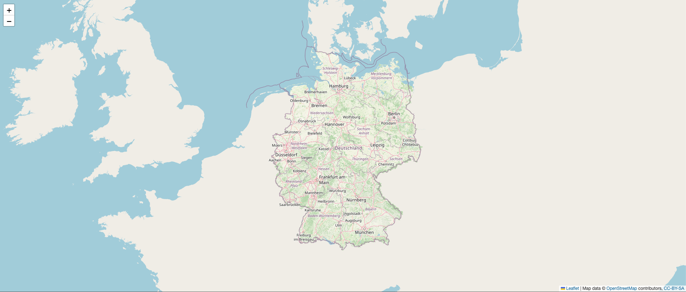

# 🗺️ Offline OpenStreetMap Tile-Server (Docker-basiert)

Ein vollständiger, offlinefähiger OpenStreetMap Tile-Server – lokal gehostet per Docker, ideal für eigene Kartenanwendungen oder Intranets.



---

## 📁 Verzeichnisstruktur

```
osm-server/
├── import/
│   ├── region.osm.pbf       ← OSM-Daten (z. B. Germany von Geofabrik)
│   ├── style/               ← Style-Verzeichnis (osm-carto, LUA, .style)
│   └── tiles/               ← Muss manuell existieren!
```

---

## 🚀 Setup in 5 Schritten

### 1. Repository vorbereiten

```bash
mkdir -p ~/osm-server/import/style
mkdir -p ~/osm-server/import/tiles
cd ~/osm-server
```

---

### 2. OSM-Daten herunterladen

```bash
wget https://download.geofabrik.de/europe/germany-latest.osm.pbf -O import/region.osm.pbf
```

---

### 3. Datenbank importieren

```bash
docker run -d \
  --name osm-import-background \
  -v $(pwd)/import:/data \
  overv/openstreetmap-tile-server import
```

### Logs prüfen:

```bash
docker logs -f osm-import-background
```

Fertig, wenn du siehst:
```
+ sudo -u renderer touch /data/database/planet-import-complete
+ service postgresql stop
```

---

### 4. Tile-Server starten

```bash
# Stoppe alten Container (falls vorhanden)
docker stop osm-server 2>/dev/null || true
docker rm osm-server 2>/dev/null || true

# Starte neuen Container
docker run -d \
  --name osm-server \
  --shm-size=1g \
  -p 8080:80 \
  -v $(pwd)/import:/data \
  overv/openstreetmap-tile-server run
```

---

### 5. Test im Browser

```txt
http://<dein-server>:8080
```

---

## ✅ Status-Checkliste

| Aufgabe                                                | Status |
|---------------------------------------------------------|--------|
| PBF-Datei liegt als `region.osm.pbf` in `import/`       | ✅     |
| Style-Verzeichnis `import/style/` vorhanden             | ✅     |
| Verzeichnis `import/tiles/` vorhanden                   | ✅     |
| Import erfolgreich abgeschlossen                        | ✅     |
| Tile-Server läuft auf Port 8080                         | ✅     |

---

## 🔧 Nützliche Befehle

```bash
# Nur letzte 50 Zeilen vom Import:
docker logs osm-import-background | tail -n 50

# Prüfen ob Import noch läuft:
docker ps | grep osm-import-background

# Tile-Server-Logs anzeigen:
docker logs -f osm-server

# Tile-Server stoppen:
docker rm -f osm-server

# Tile-Server Ressourcennutzung:
docker stats
```

---

## 🎯 Pre-Rendering Tipp

Für bessere Performance kannst du Tiles vorab rendern:

```bash
chmod +x render_tiles.sh
./render_tiles.sh
```

**Das Script läuft im Hintergrund - du kannst dich sicher abmelden!**

**Logs findest du im Ordner `./render_logs`**

z. B. `zoom_9.log`, `zoom_10.log`, ...

**Fortschritt verfolgen:**
```bash
tail -f render_logs/background.log
```

**Beispiel-Output:**
```bash
SERVER $ tail -f render_logs/background.log
Starte Zoom 9 ...
OK: Zoom 9 abgeschlossen.
Starte Zoom 10 ...
OK: Zoom 10 abgeschlossen.
Starte Zoom 11 ...
```

**Spezifische Zoom-Level Logs:**
```bash
tail -f render_logs/zoom_14.log
```

**Fertige Zoom-Level prüfen:**
```bash
cat render_logs/done.txt
```

**Render-Prozesse stoppen:**
```bash
docker exec osm-server pkill -f render_list
```

---

## ℹ️ Hinweis

Verwendetes Image:  
👉 [`overv/openstreetmap-tile-server`](https://hub.docker.com/r/overv/openstreetmap-tile-server)

Start erfolgt **ohne Docker Compose**, stattdessen direkt über `docker run` (besser kontrollierbar).
